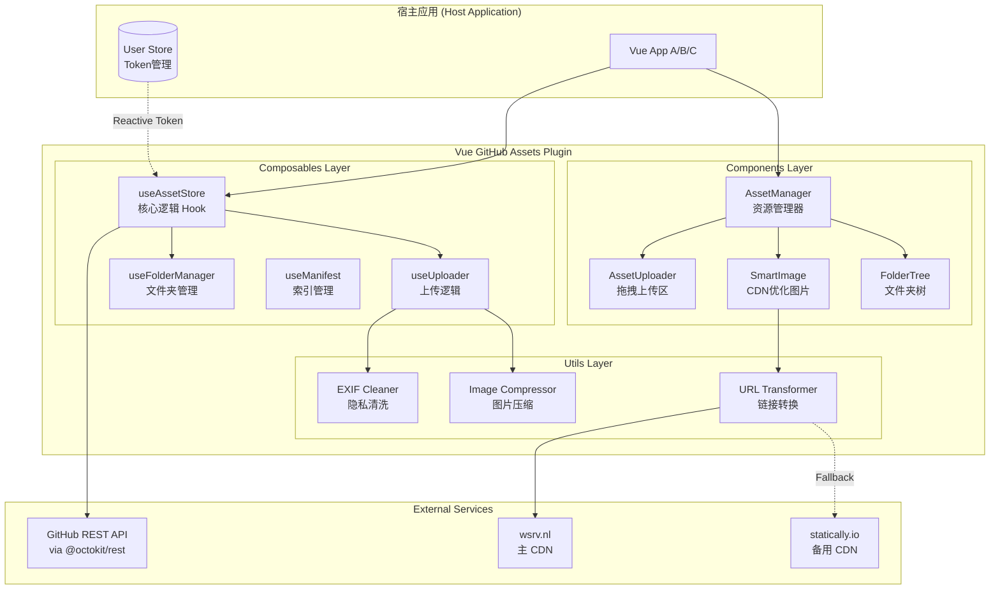

# Vue GitHub Assets Plugin - 架构设计文档

> 一个用于管理 GitHub 仓库图片资源的 Vue 3 插件，支持上传、管理、CDN 优化等功能。

## 一、架构设计图



---

## 二、核心模块设计

### 2.1 Composables 层

#### `useAssetStore` - 核心入口

```typescript
interface StoreConfig {
  token: MaybeRefOrGetter<string>; // 响应式 Token
  owner: string; // GitHub 用户名
  repo: string; // 仓库名
  branch?: string; // 分支 (default: 'main')
  basePath?: string; // 基础路径 (default: '')
  generatePath?: (file: File) => string; // 自定义路径生成
}

interface UseAssetStoreReturn {
  // 状态
  loading: Ref<boolean>;
  error: Ref<Error | null>;
  fileList: Ref<AssetItem[]>;
  folders: Ref<FolderItem[]>;

  // 方法
  upload: (file: File, options?: UploadOptions) => Promise<UploadResult>;
  uploadMultiple: (
    files: File[],
    options?: UploadOptions
  ) => Promise<UploadResult[]>;
  fetchList: (path?: string) => Promise<void>;
  remove: (item: AssetItem) => Promise<void>;
  removeMultiple: (items: AssetItem[]) => Promise<void>;
  createFolder: (name: string, parentPath?: string) => Promise<void>;

  // URL 生成
  getDisplayUrl: (item: AssetItem) => string; // GitHub Pages URL
  getOptimizedUrl: (item: AssetItem) => string; // CDN 优化 URL
}
```

#### `useUploader` - 上传逻辑

```typescript
interface UploadOptions {
  skipExifClean?: boolean; // 跳过 EXIF 清洗 (default: false)
  compress?: CompressOptions; // 压缩选项 (default: null = 不压缩)
  folder?: string; // 目标文件夹
}

interface CompressOptions {
  maxWidth?: number;
  maxHeight?: number;
  quality?: number; // 0-1
  convertToWebP?: boolean;
}

interface UploadResult {
  success: boolean;
  url?: string; // GitHub Pages URL
  rawUrl?: string; // Raw URL
  error?: Error;
}
```

---

### 2.2 Components 层

#### `<AssetManager>` - 资源管理器

完整的资源管理 UI，包含上传区、文件夹树、图片网格。

```vue
<AssetManager
  :config="storeConfig"
  :show-folders="true"
  :show-uploader="true"
  :copy-formats="['url', 'markdown', 'html']"
  @select="handleSelect"
  @upload="handleUpload"
  @delete="handleDelete"
/>
```

#### `<SmartImage>` - CDN 优化图片

自动将 GitHub Pages URL 转换为 CDN 优化链接。

```vue
<SmartImage
  :src="'https://jixiaoyong.github.io/images/photo.jpg'"
  :width="800"
  :quality="75"
  :lazy="true"
  :fallback-cdn="'statically'"
/>
```

**URL 转换逻辑:**

```
输入: https://jixiaoyong.github.io/images/photos/cat.jpg
  ↓
提取路径: photos/cat.jpg
  ↓
构造 Raw URL: https://raw.githubusercontent.com/jixiaoyong/images/main/photos/cat.jpg
  ↓
构造 CDN URL: https://wsrv.nl/?url={rawUrl}&output=webp&q=75&w=800
```

#### `<AssetUploader>` - 拖拽上传

```vue
<AssetUploader
  :config="storeConfig"
  :accept="['image/*']"
  :multiple="true"
  :max-size="10 * 1024 * 1024"
  @upload="handleUpload"
  @error="handleError"
>
  <!-- 自定义上传区内容 -->
  <template #default="{ isDragging }">
    <div :class="{ dragging: isDragging }">
      拖拽图片到此处
    </div>
  </template>
</AssetUploader>
```

---

### 2.3 Utils 层

#### EXIF Cleaner

清洗图片中的隐私信息（GPS 位置、设备信息等）。

```typescript
async function cleanExif(file: File): Promise<File>;
```

#### Image Compressor

可选的图片压缩功能。

```typescript
async function compressImage(
  file: File,
  options: CompressOptions
): Promise<File>;
```

#### URL Transformer

GitHub Pages URL ↔ Raw URL ↔ CDN URL 互转。

```typescript
interface UrlTransformerConfig {
  owner: string;
  repo: string;
  branch: string;
  primaryCdn: "wsrv" | "statically";
  fallbackCdn?: "wsrv" | "statically";
}

function toRawUrl(pagesUrl: string): string;
function toCdnUrl(rawUrl: string, options?: CdnOptions): string;
function toDisplayUrl(rawUrl: string): string; // 返回 GitHub Pages URL
```

---

## 三、依赖管理策略

### peerDependencies (由宿主提供)

```json
{
  "peerDependencies": {
    "vue": "^3.3.0",
    "@octokit/rest": "^19.0.0 || ^20.0.0"
  }
}
```

### 插件自身依赖

```json
{
  "dependencies": {
    // 仅包含体积极小的工具库
  },
  "devDependencies": {
    "vue": "^3.5.0",
    "@octokit/rest": "^20.0.0",
    "typescript": "^5.0.0",
    "vite": "^5.0.0",
    "vite-plugin-dts": "^3.0.0"
  }
}
```

---

## 四、URL 返回策略

### 上传后返回给调用方

```typescript
// 返回的是 GitHub Pages URL 格式
{
  url: "https://jixiaoyong.github.io/images/photos/2024/image.jpg";
}
```

**原因:**

1. 语义化更好，适合写入 Markdown
2. 对外展示更专业
3. 实际加载时由 `SmartImage` 自动转换为 CDN 链接

### 内部加载时

```typescript
// SmartImage 内部自动转换
GitHub Pages URL
  → Raw URL
  → CDN URL (wsrv.nl / statically)
```

---

## 五、CDN 策略

### 主 CDN: wsrv.nl

```
https://wsrv.nl/?url={rawUrl}&output=webp&q=75&w=800
```

**特点:**

- 自动 WebP 转换
- 支持尺寸调整
- 全球 CDN 加速

### 备用 CDN: Statically

```
https://cdn.statically.io/gh/{owner}/{repo}/{branch}/{path}
```

**特点:**

- 针对 GitHub 优化
- 自动压缩
- 无需编码 URL

### 降级策略

```typescript
<picture>
  <source :srcset="wsrvUrl" type="image/webp">
  <source :srcset="staticallyUrl" type="image/*">
  
</picture>
```

---

## 六、主题系统

### CSS 变量定义

```css
:root {
  /* Light Theme */
  --vga-bg-primary: #ffffff;
  --vga-bg-secondary: #f2f2f7;
  --vga-bg-tertiary: #e5e5ea;
  --vga-text-primary: #000000;
  --vga-text-secondary: #3c3c43;
  --vga-accent: #007aff;
  --vga-destructive: #ff3b30;
  --vga-success: #34c759;
  --vga-border: rgba(60, 60, 67, 0.12);
  --vga-radius: 12px;
  --vga-radius-sm: 8px;
  --vga-shadow: 0 2px 8px rgba(0, 0, 0, 0.08);
}

@media (prefers-color-scheme: dark) {
  :root {
    --vga-bg-primary: #000000;
    --vga-bg-secondary: #1c1c1e;
    --vga-bg-tertiary: #2c2c2e;
    --vga-text-primary: #ffffff;
    --vga-text-secondary: #ebebf5;
    --vga-accent: #0a84ff;
    --vga-destructive: #ff453a;
    --vga-success: #30d158;
    --vga-border: rgba(84, 84, 88, 0.65);
  }
}
```

---

## 七、目录结构

```
vue-github-assets/
├── src/
│   ├── composables/
│   │   ├── useAssetStore.ts
│   │   ├── useUploader.ts
│   │   └── useFolderManager.ts
│   ├── components/
│   │   ├── AssetManager.vue
│   │   ├── AssetUploader.vue
│   │   ├── AssetGrid.vue
│   │   ├── SmartImage.vue
│   │   ├── FolderTree.vue
│   │   └── CopyFormatMenu.vue
│   ├── utils/
│   │   ├── exif-cleaner.ts
│   │   ├── image-compressor.ts
│   │   └── url-transformer.ts
│   ├── styles/
│   │   ├── variables.css
│   │   ├── theme.css
│   │   └── components.css
│   ├── types/
│   │   └── index.ts
│   └── index.ts              # 导出入口
├── docs/
│   ├── ARCHITECTURE.md       # 本文档
│   └── USAGE.md              # 使用指南
├── .agent/
│   └── guidelines.md         # 开发规范
├── package.json
├── tsconfig.json
├── vite.config.ts
└── README.md
```

---

## 八、发布策略

### 开发阶段: GitHub Packages (私有)

```json
{
  "name": "@jixiaoyong/vue-github-assets",
  "publishConfig": {
    "registry": "https://npm.pkg.github.com"
  }
}
```

### 安装方式

```bash
# 1. 配置 .npmrc
echo "@jixiaoyong:registry=https://npm.pkg.github.com" >> .npmrc

# 2. 认证
npm login --registry=https://npm.pkg.github.com

# 3. 安装
npm install @jixiaoyong/vue-github-assets
```

---

## 九、Manifest 索引机制

### 概述

为加速文件列表加载，在 images 仓库维护一个 `.vga-manifest.json` 索引文件。

### 数据结构

```typescript
interface VgaManifest {
  version: string; // 格式版本
  lastUpdated: string; // ISO 时间戳
  lastSyncedSha: string; // 根目录 SHA
  files: AssetItem[];
  folders: string[];
}

interface AssetItem {
  name: string;
  path: string;
  size: number;
  sha: string;
  mimeType?: string;
  uploadedAt?: string;
}
```

### 加载策略 (Stale-While-Revalidate)

```
1. 首屏 → 立即显示 manifest 缓存
2. 后台 → GitHub API 校验真实数据
3. 差异 → 更新 manifest + 刷新 UI
```

### 校验时机

- 首次加载
- 操作失败（404/409）
- 用户手动刷新

---

## 十、GitHub Action 自动同步

在 images 仓库配置 Action，每次文件变化自动更新 manifest。

### 工作流配置

```yaml
# .github/workflows/update-manifest.yml
name: Update Asset Manifest

on:
  push:
    branches: [main]
    paths-ignore:
      - ".vga-manifest.json"

jobs:
  update-manifest:
    runs-on: ubuntu-latest
    steps:
      - uses: actions/checkout@v4

      - name: Generate Manifest
        run: |
          node scripts/generate-manifest.js

      - name: Commit Manifest
        run: |
          git config user.name "github-actions[bot]"
          git config user.email "github-actions[bot]@users.noreply.github.com"
          git add .vga-manifest.json
          git diff --staged --quiet || git commit -m "chore: update asset manifest"
          git push
```

### 生成脚本

```javascript
// scripts/generate-manifest.js
const fs = require("fs");
const path = require("path");

const IGNORE = [".git", ".github", "scripts", ".vga-manifest.json"];
const IMAGE_EXTS = [".jpg", ".jpeg", ".png", ".gif", ".webp", ".svg"];

function scanDir(dir, basePath = "") {
  const files = [];
  const folders = [];

  for (const entry of fs.readdirSync(dir, { withFileTypes: true })) {
    if (IGNORE.includes(entry.name)) continue;

    const fullPath = path.join(dir, entry.name);
    const relativePath = path.join(basePath, entry.name);

    if (entry.isDirectory()) {
      folders.push(relativePath);
      const sub = scanDir(fullPath, relativePath);
      files.push(...sub.files);
      folders.push(...sub.folders);
    } else if (IMAGE_EXTS.includes(path.extname(entry.name).toLowerCase())) {
      const stat = fs.statSync(fullPath);
      files.push({
        name: entry.name,
        path: relativePath,
        size: stat.size,
        mimeType: "image/" + path.extname(entry.name).slice(1),
      });
    }
  }

  return { files, folders };
}

const { files, folders } = scanDir(".");
const manifest = {
  version: "1.0.0",
  lastUpdated: new Date().toISOString(),
  files,
  folders: [...new Set(folders)],
};

fs.writeFileSync(".vga-manifest.json", JSON.stringify(manifest, null, 2));
console.log(
  `Generated manifest: ${files.length} files, ${folders.length} folders`
);
```

---

## 十一、forceRefresh 缓存刷新

当覆盖上传同名文件后，调用 `forceRefresh()` 强制刷新：

```typescript
const { forceRefresh } = useAssetStore(config);

// 覆盖上传后
await forceRefresh("path/to/image.jpg");
// 内部给 URL 加时间戳，穿透 CDN 缓存
```

---

## 十二、后续考虑

- [ ] 支持视频文件上传
- [ ] 支持多仓库切换
- [ ] 离线缓存策略
- [ ] 上传进度显示
- [ ] 图片标签/分类
